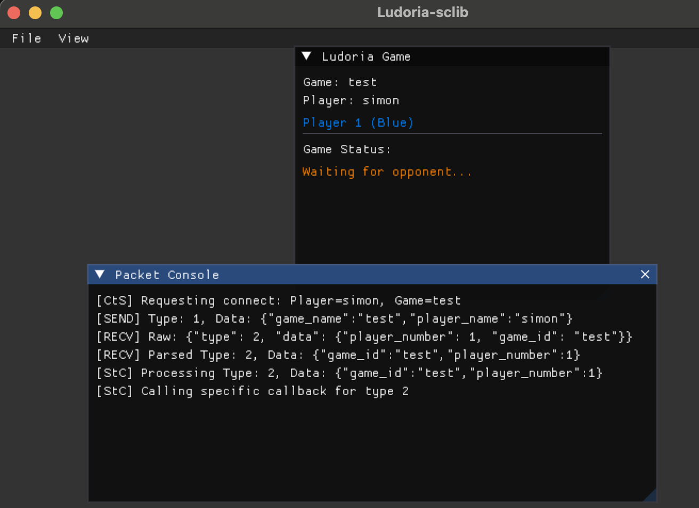
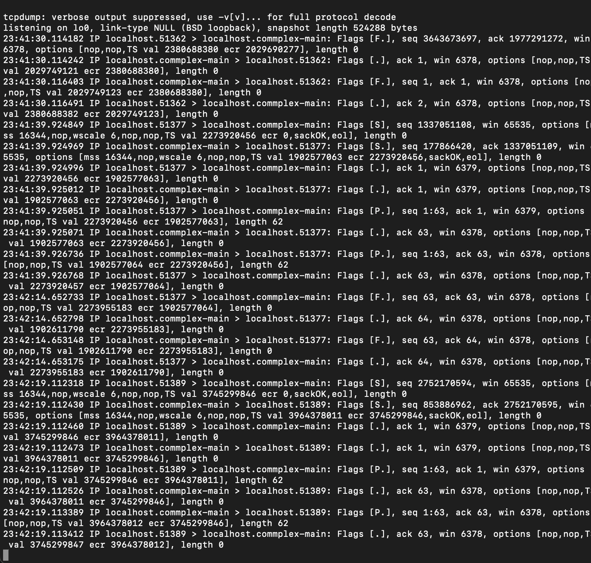

# Ludoria-sclib




## Project Overview

Ludoria is a board **game** developed as a final project for the first year @SUPINFO. The game features 3 mini-games and allows players to compete against friends on the same **computer**, play against a **bot**, or challenge someone over the **network**.

We designed and built the server in Python to support various types of **network** **traffic**, aiming for a robust and flexible architecture. The structure makes it easy to find and manage game sessions across the **network**.

This project explores the idea of **intercepting** or manually interacting with the server, either to create a Model Control Point (**MCP**) for **AI** **integration** (such as with Llama 3.2) or to experiment with game automation and **security**.

## Project Goal

The main goal of the *ludoria-sclib* project is to **reverse-engineer** some of the network packets and discover ways to interact with the **server**.

To start, we gonna use a **TCP logger** to monitor traffic on port 5000 (port that we can find using **Netlimiter** for example). Once we log in to the game client, we can run the following command on macOS to view all **packets** sent and received on this port:

```bash
sudo tcpdump -i lo0 port 5000
```

This will display the network activity, such as repeated connections and disconnections.



By analyzing these patterns, we can start decoding the packets using tools like **Wireshark**. 

> [!Warning]
> Note that capturing packets on a local environment can be challenging due to the **loopback** interface (127.0.0.1).

---

Alternatively, on Windows, we can use **Win32dbg** with a compiled version of the game to identify frequently called functions in the assembly code. By letting the game idle, we can filter out less relevant addresses, and by performing actions, we can spot recurring addresses related to packet handling, UI, or the main game loop.

Once we identify the address of the packet receiving function, we can hook into the game’s assembly. This allows us to divert execution to our own code (such as a C++ DLL) before the original function is called, making it easier to monitor packet handling : 


Suppose the original function starts at address 0x401000 and we want to hook it to our own handler at 0x500000.

Original function (before hooking):
```
0x401000:  55                push ebp
0x401001:  8B EC             mov ebp, esp
0x401003:  83 EC 10          sub esp, 0x10
0x401006:  ...               ; rest of function
```
we overwrite the start of the function with a jump to our handler
The x86 near jump is 5 bytes.

patched original function:
```
0x401000:  E9 FB FE 0E 00    jmp 0x500000      ; jump to our handler
0x401005:  90                nop               ; pad if needed
0x401006:  ...               ; rest of function
```

our handler (at 0x500000):
```
0x500000:  60                pushad
0x500001:  9C                pushfd

; code here like calling our own c++ function to log content here

0x500002:  9D                popfd
0x500003:  61                popad

0x500004:  E9 F7 01 EF FF    jmp 0x401005      ; jump to original+5 (we go back from where we jumped)
```

So basically instead of doing 0x401000 -> 0x401005 -> 0x401006

we do something like :
0x401000 -> 0x500000 -> 0x401005 -> 0x401006
By editing assembly.


---

Having access to the server source code can speed up this process. For example, we might find packet headers like:

```c++
enum class PacketType : uint8_t {
    CONNECT = 0x1,
    GAME_ACTION = 0x5,
    DISCONNECT = 0x8,
    PLAYER_ASSIGNMENT = 0x2,
    YOUR_TURN = 0x3,
    WAIT_TURN = 0x4,
    GAME_STATE = 0x6,
    PLAYER_DISCONNECTED = 0x7
};
```

With this information, we can reconstruct the client’s network logic like:

```c++
sockaddr_in serv_addr;
memset(&serv_addr, 0, sizeof(serv_addr));
serv_addr.sin_family = AF_INET;
serv_addr.sin_port = htons(config.get_port());

int convert_result = inet_pton(AF_INET, config.get_host().c_str(), &serv_addr.sin_addr);
int connection_status = ::connect(sock, (struct sockaddr*)&serv_addr, sizeof(serv_addr));
```

Once the socket is established, we can send packets. We must pay attention to whether the packets use JSON or another format as seen in Wireshark or debuggers:

```c++
json connect_data = {
    {"player_name", player_name},
    {"game_name", game_name}
};

return send_packet(PacketType::CONNECT, connect_data);
```

To handle incoming packets, it’s best to register callbacks for specific packet types or actions:

```c++
void on_your_turn(const json& data) {
    bool my_turn = true;
    std::cout << "It's your turn to play!" << std::endl;

    if (data.contains("game_state")) {
        std::cout << "Current game state: " << data["game_state"].dump() << std::endl;
    }

    json move;
    move["action"] = "place_piece";
    move["position"] = {3, 4};
    // net.send_move(move);
}

int main() {
    net.register_callback(PacketType::WAIT_TURN, on_wait_turn);
}
```
C++ makes callbacks easier to setup, and Hooks are easier to setup too if you inject code into game.

This approach allows us to react to server actions, update the game state, and automate gameplay.

> [!TIP]
>  With this setup, we can:
> - Build a bot in another language that   properly handles and formats packets
> - Capture packets for specific actions and  test the server for vulnerabilities
> - Create an MCP to integrate AI and automate gameplay

## Building the Project

The project uses OpenGL and GLFW3 with ImGui for the user interface.

You may need to install the following dependencies:

```bash
# Ubuntu
sudo apt-get install libgl1-mesa-dev libglfw3-dev

# macOS
brew install glfw

# Windows
# use vcpkg from windows maybe or build manually
```

To build and run the project:

```bash
mkdir build
cd build
cmake ..
cmake --build .
./Ludoria-scbot
```

Run the server of Ludoria or get an access [here](https://github.com/simonpotel/Ludoria)